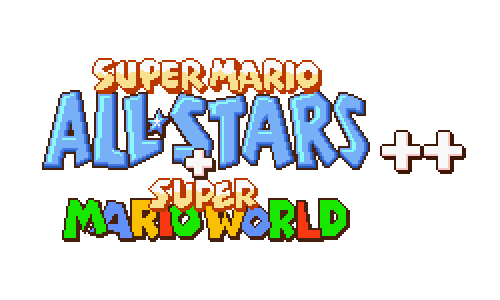

<!-- PROJECT LOGO -->
 

  

<h3 align="center">Super Mario All-Stars++</h3>

    A project that recreates Super Mario All-Stars, with many more games, new features, and surprises
     
     
    <a href="https://github.com/SpencerEverly/smasplusplus/issues">Report Bugs</a>
    ·
    <a href="https://github.com/SpencerEverly/smasplusplus/wiki">How to install (Coming soon)</a>
  

    For more information on the people responsible for the episode, please take a look at the <a href="https://github.com/nika5thgearluffy/smasplusplus/blob/main/_CREDITS.txt">_CREDITS.txt</a> file.
     

